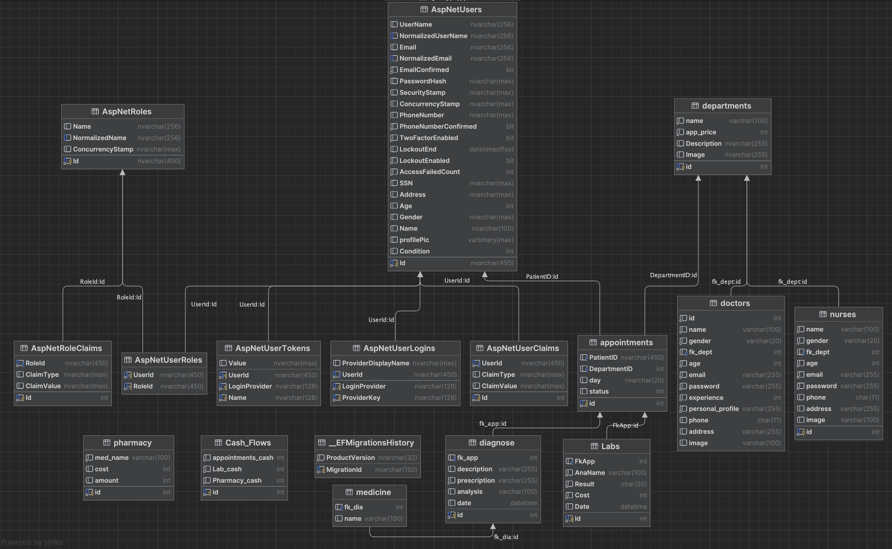
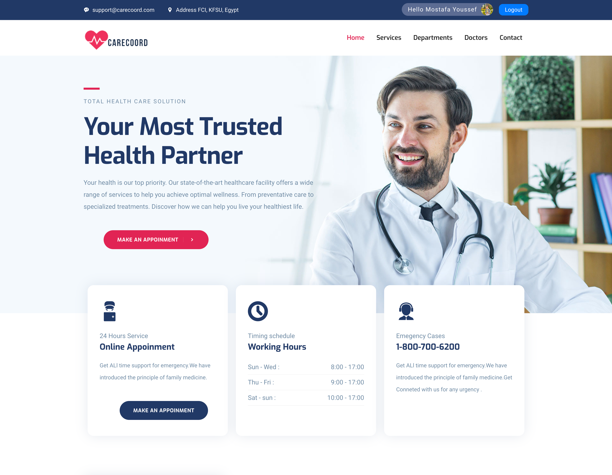
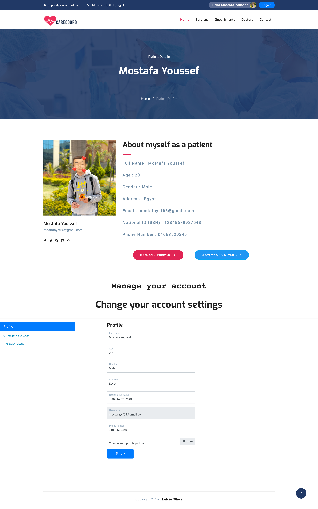
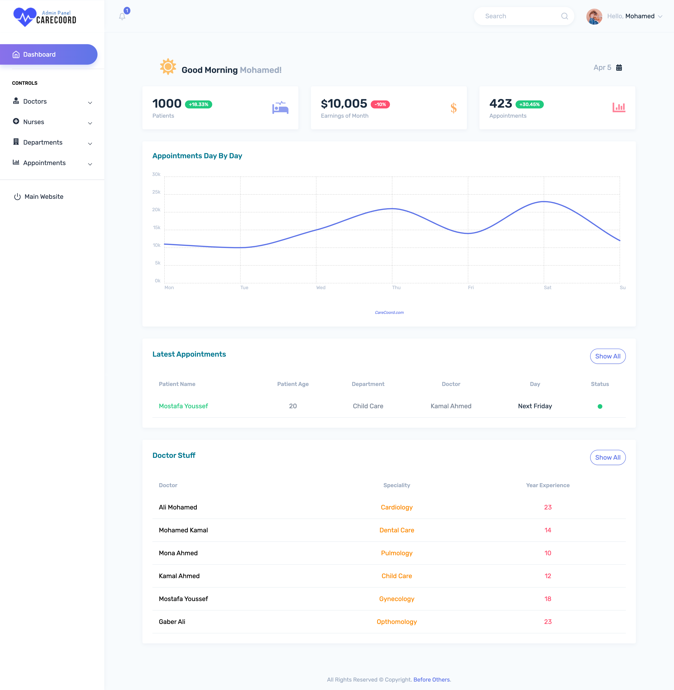
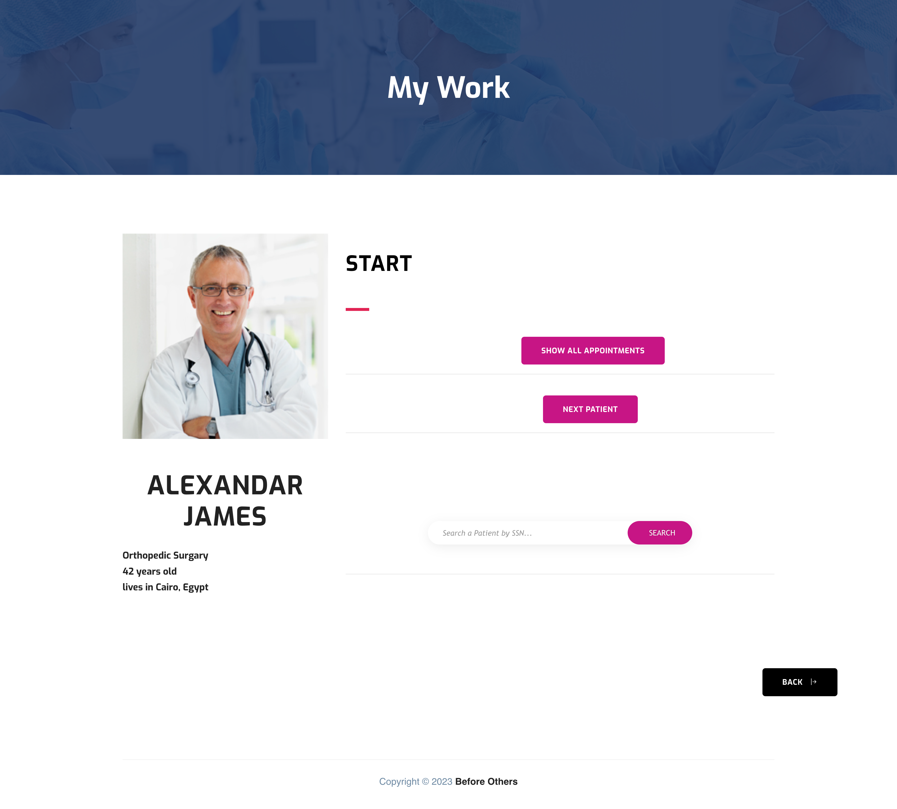
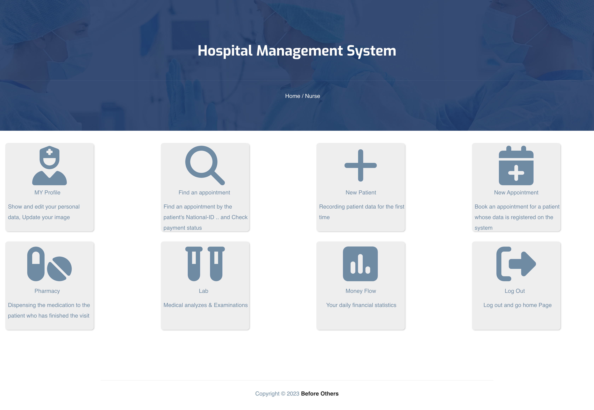

# Hospital Management System (CareCoord)

## About the Project:

- I developed a Web Application with my team at the colleage for Managing a whole hodpital system. The patient can make appointment from his home and then go to the hospital

- The biggest problem facing health care centres remains today. Technical problems. There is a rare health care centre that works with a modern and organised technical system that helps it organise the schedule, payment methods, save patient data, and communicate. So we were keen to find a solution to this problem, Through a Website that contains pages for the patient that enables him to record his data, book an appointment to visit the doctor, describe the pain, and view the doctor's data, pages for the nurse that enables her to confirm the patient's reservation and conduct medical tests, and pages for the doctor that enables him to view the patient's data, write his prescription, and show the medical history for the patient and pages for admin to control the whole system.

## Technologies

- Front-End:
  - HTML
  - CSS
  - JavaScript
  - BootStrap

- Back-End
  - C#
  - ASP.NET Core (7)
  - MVC Pattern
  - MS SQL Server

## Features:

- [x] The patient can register to the system an create his account.

- [x] The patient can make an appointment from home.

- [x] The system sent an email to the patient to confirm his email when he register and another email when he makes an appointment to tell him information about his appountment .

- [x] The project has an admin panel to have control over all doctors' and nurses' accounts, departments, and appointments.

- [x] Doctor can write a medicine to the patient in the prescription.

- [x] The patient can get that medicine from the pharmacy with the nurse.

## Setup
follow the following steps to run the project.

- Clone this repo on your local machine.

- Download .Net7 from [.NET 7.0](https://dotnet.microsoft.com/en-us/download)

- Restore the DataBase of the project (You can find the DataBase file.bak [here](https://drive.google.com/file/d/1_TnUfVgqPKX_jGhXDnGPRs79wpcDQlv9/view?usp=sharing)) 

- Set Your Connection String in three files
  
  - `HMSproject/appsettings.json`
  - `HMSproject/Controllers/Nurse_aymanController.cs`
  - `HMSproject/Areas/Identity/Pages/Account/Manage/DeletePersonalData.cshtml.cs`

### My team who Contributed in the project :
- [Ayman Mohamed](https://github.com/AymanYassien)
- [Fawzy Shaker](https://github.com/fawziielfaramawii)
- [Mohamed Adel](https://github.com/Mohamed-Adel23)

### Supervisors:
- Dr. Mai Ramadan
- Eng. Abdelghany Adel

## DataBase Diagram

## ScreenShots From the project:

